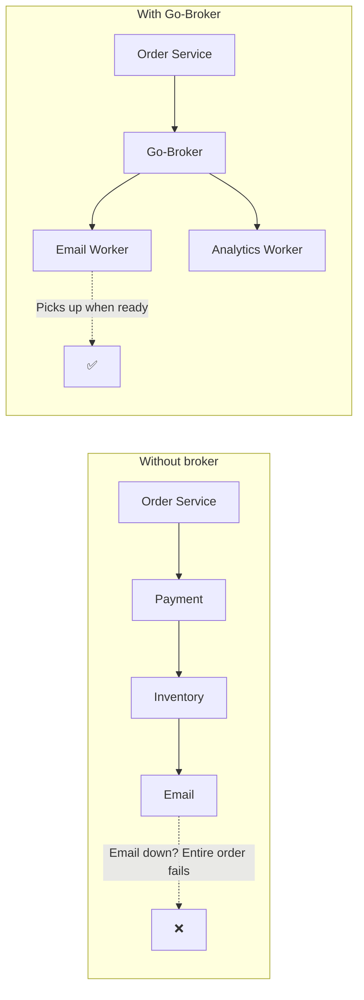
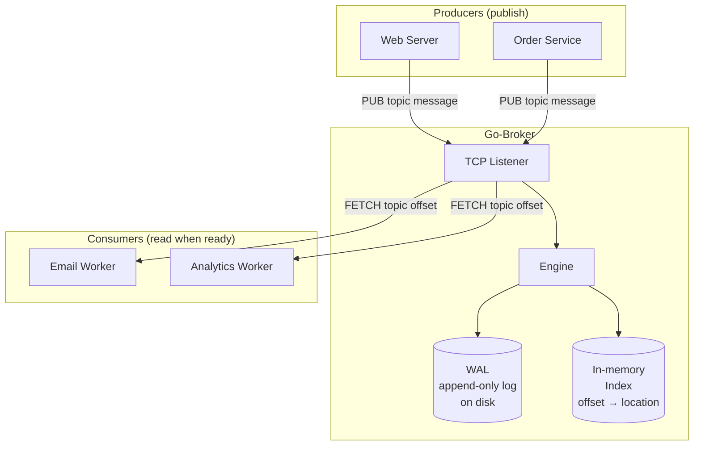

# Go-Broker

A small **message broker** that lets your services talk asynchronously over **TCP**. Producers publish messages to topics; consumers read them when they’re ready. If a consumer is down, messages wait safely on disk until it’s back.

---

## The story: what problem we’re solving

Imagine an e‑commerce site. When a user places an order, several things must happen:

1. Take payment  
2. Update inventory  
3. Send a confirmation email  

If the **Order Service** calls the **Payment Service**, then **Inventory**, then **Email** one after another, the whole flow is **coupled**:  
**if the Email Service is down, the order can fail** — not because payment or inventory failed, but because “send email” failed. The user can’t complete the purchase just because the email server had a hiccup. That’s the problem.

**Go-Broker** sits in the middle and **decouples** these steps:

- The Order Service only has to say: *“Here’s a message for the ‘orders’ topic.”* Then it’s done.
- The Email Worker subscribes to the “orders” topic and processes messages **when it’s ready**.
- If the Email Worker is down, messages **stay in Go-Broker** (on disk) until it comes back. No loss, no blocking the order.

So: **we’re building a simple queue so services don’t have to call each other directly.** Less coupling, more resilience.

---

## How it fits in (big picture)



---

## What Go-Broker does (architecture)



- **Producers** send messages to a **topic** (e.g. `orders`, `logs`).
- **Go-Broker** receives over **TCP**, appends to a **write-ahead log (WAL)** on disk, and keeps an **index** (e.g. offset → location).
- **Consumers** ask for messages by topic and offset; they get data from disk. If they’re down, messages stay in the broker.

---

## Simple example (how it’s used)

**1. Producer** (e.g. Order Service) publishes one message:

```text
PUB orders 15\r\n
{"order_id":101}
```

Broker stores it, answers something like: `OK 50` (offset 50).

**2. Consumer** (e.g. Email Worker) later fetches from that topic at that offset:

```text
FETCH orders 50
```

Broker replies with the message, e.g.:

```text
MSG 50 15\r\n
{"order_id":101}
```

So: **producers PUB, consumers FETCH**. Both talk to Go-Broker over TCP; the broker handles durability and ordering.

---

## Protocol (reminder)

| Direction   | Format |
|------------|--------|
| Publish    | `PUB <topic> <payload_size>\r\n<payload>` |
| Broker → Producer | `OK <offset>` |
| Fetch      | `FETCH <topic> <offset>` |
| Broker → Consumer | `MSG <id> <size>\r\n<payload>` |

---

## What’s in this repo (what we’re building)

- **Config** – load from `config.json` (server host/port, storage).
- **Storage (WAL)** – append-only log per topic, length-prefixed messages, random read by offset (e.g. `./data/orders/0000.log`).
- **TCP server** – accept connections and implement the PUB/FETCH protocol (to be wired to the engine + WAL).

When you open this project again, the diagrams above should be enough to recall: **we’re building a TCP-based message broker that decouples services using topics and a durable log.**

---

## Run locally

```bash
go run .
```

(Ensure `config.json` exists; by default it uses `./data` for storage. Data directory is gitignored.)

---

## License

Use and adapt as you like.
